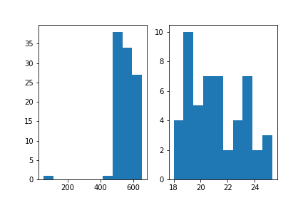
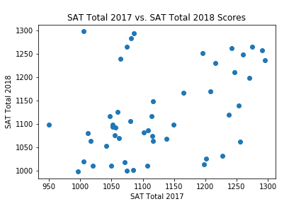

# Project 1: SAT & ACT Analysis

## Table of Contents
[1.0 Directory Structure](#1.0-Directory-Structure)<br>
[2.0 Project Outline / Problem Statement](#2.0-Project-Outline-/-Problem-Statement)<br>
[3.0 Description of Data](#3.0-Description-of-Data)<br>
-[3.1 Size](#3.1-Size)<br>
-[3.2 Source](#3.2-Source)<br>
-[3.3 Data Dictionary](#3.3-Data-Dictionary)<br>
[4.0 Data Visualization](#4.0-Data-Visualization)<br>
[5.0 Conclusion](#5.0-Conclusion)<br>
-[5.1 Next Steps](#5.1-Next-Steps)<br>
[6.0 Outside Sources](#6.0-Outside-Sources)<br>

## 1.0 Directory Structure

```
.
├── project_1
    ├── code
        ├── starter-code.ipynb
    ├── data
        ├── act_2018.csv
        ├── act_2017.csv
        ├── sat_2018.csv
        ├── sat_2017.csv
        ├── combined_2017.csv
        ├── combined_2018.csv
        ├── final.csv
    ├── plots
        ├── combined_tests_hist.png
        ├── combined_tests_math_hist.png
        ├── combined_tests_part_hist.png
        ├── combined_tests_reading_hist.png
        ├── SAT_ACT_heatmap.png
        ├── sat_act_math_2017.png
        ├── sat_act_reading_2017.png
        ├── sat_act_total_2017.png
        ├── sat_total__2017_2018.png
        ├── ACT 2017 Score.png
        ├── ACT 2018 Score.png
        ├── SAT 2017 Participation Rate Alabama.png
        ├── SAT 2018 Participation Rate Alabama.png
        ├── Sweet-Home-Alabama.jpg
        ├── ACT 2017 Participation State Sample.png
        ├── sat act combined tests heat map.png
        ├── act_composite_2017_2018.png
    ├── Project 1 SAT ACT Analysis- Tri Nguyen.pdf
    ├── README.md
    └── sat_project.pdf
```

## 2.0 Project Outline / Problem Statement

Alabama has a low participation rate in the SAT standardized test.


---
## 3.0 Description of Data

### 3.1 Size

### 3.2 Source

[here](https://blog.collegevine.com/here-are-the-average-sat-scores-by-state/)
[here](https://blog.prepscholar.com/act-scores-by-state-averages-highs-and-lows)

### 3.3 Data Dictionary

## SAT

|Feature|Type|Dataset|Description|
|---|---|---|---|
|state|object|SAT/ACT|List of states in the United States, plus Washington D.C.| 
|sat_participation_rates|float|SAT|The participation rate of students within the state who took the SAT exam.|
|reading_and_writing|integer|SAT|The average Reading and Writing score of the SAT exam within the state.|
|sat_math|integer|SAT|The average Math score of the SAT exam within the state.|
|total|integer|SAT|The sum total score of the SAT exam within the state.|

## ACT
|Feature|Type|Dataset|Description|
|---|---|---|---|
|state|object|SAT/ACT|List of states in the United States, plus Washington D.C.| 
|act_participation_rates|float|ACT|The participation rate of students within the state who took the ACT exam.|
|english|float|ACT|The average English score of the ACT exam within the state.|
|act_math|float|ACT|The average Math score of the ACT exam within the state.|
|reading|float|ACT|The average Reading score of the ACT exam within the state.|
|science|float|ACT|The average Science score of the ACT exam within the state.|
|composite|object|ACT|The sum total score of the ACT exam within the state.|

---
## 4.0 Data Visualization








---
## 5.0 Conclusion


### 5.1 Next Steps


---
## 6.0 Outside Sources

- [ACT](https://blog.prepscholar.com/which-states-require-the-act-full-list-and-advice)
- [SAT and ACT Score Scale](https://www.princetonreview.com/college/sat-act)

